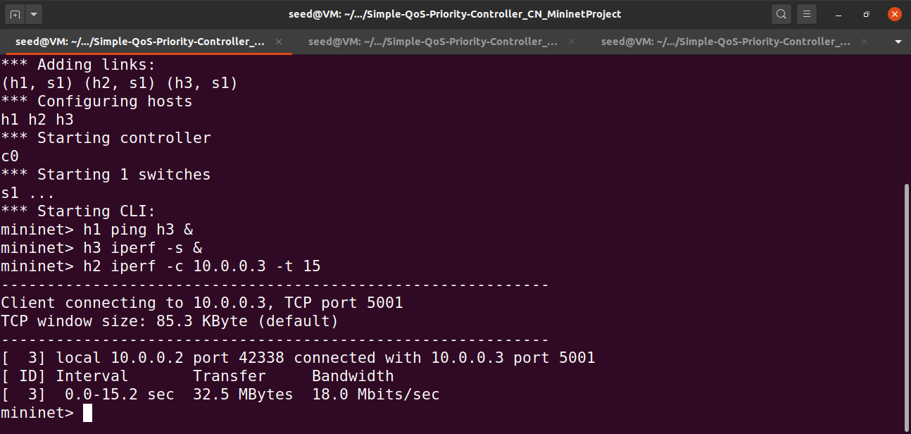
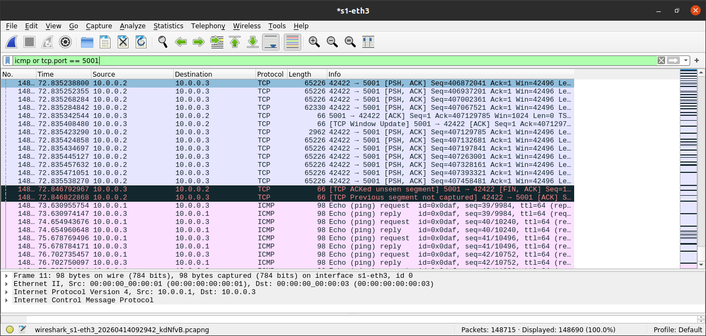
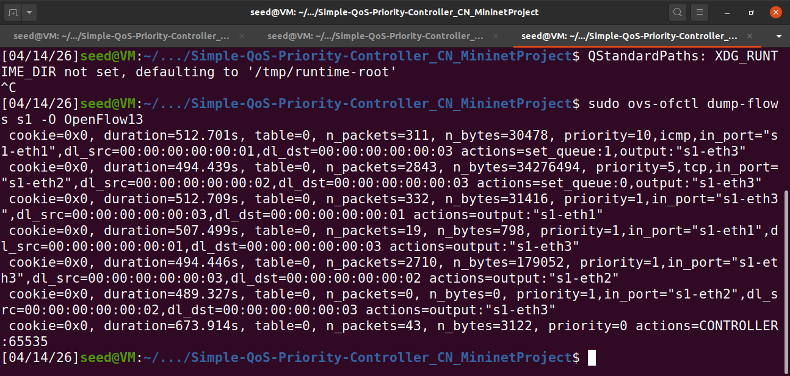

# Software Defined Networking: QoS Priority Controller

**Author:** Chiranthan Sathrasala  
**Course:** Computer Networks 

---

## 1. Problem Statement & Objective
The objective of this project is to implement a Quality of Service (QoS) solution using an SDN paradigm. In traditional networks, heavy background traffic can choke critical, real-time packets. This project demonstrates how an OpenFlow controller (Ryu) can dynamically identify high-priority traffic (ICMP/Ping) and assign it to a guaranteed-bandwidth hardware queue. This ensures low latency for priority packets even when the network is severely congested by heavy TCP traffic.

## 2. Network Topology & Design Justification
**Topology Setup:** A custom Mininet Star Topology consisting of 1 Open vSwitch (`s1`) and 3 Hosts (`h1`, `h2`, `h3`).

**Justification:** A single-switch star topology perfectly isolates the variables needed to observe QoS. Host 1 and Host 2 act as competing traffic generators, while Host 3 acts as the shared bottleneck destination. This forces the switch to make priority decisions at a single congestion point without the complexity of multi-hop routing.

## 3. SDN Controller Logic (How it Works)
The `qos_controller.py` script acts as the "brain" of the network, reacting to `packet_in` events.
1. **Learning Switch Base:** The controller first learns MAC addresses and port mappings to route traffic correctly to its destination.
2. **Match-Action Rule Design:** * When the controller detects an **IPv4 ICMP packet**, it installs a flow rule (Priority 10) directing the switch to use `Queue 1` (The Fast Lane - 80Mbps guaranteed).
   * When the controller detects an **IPv4 TCP packet**, it installs a flow rule (Priority 5) directing the switch to use `Queue 0` (The Slow Lane - capped at 20Mbps).

---

## 4. Execution Guide (Step-by-Step Setup)
*Use these steps to boot the environment and run the live demonstration.*

**Prerequisites:** Mininet, Ryu Controller, Open vSwitch, Wireshark, iperf.

### Step A: Boot the Environment
Open three separate terminal windows in the project directory (`sdn_qos_project`).

1. **Terminal 1 (Start the Ryu Controller):**
   ```bash
   ryu-manager qos_controller.py
   ```
   *(Leave this running in the background).*

2. **Terminal 2 (Launch Mininet):**
   ```bash
   sudo mn --custom qos_topo.py --topo qostopo --mac --controller=remote,ip=127.0.0.1,port=6653
   ```
   *(Wait until the `mininet>` prompt appears).*

3. **Terminal 3 (Configure Hardware Queues):**
   ```bash
   ./setup_queues.sh
   ```
   *(This creates the physical Hierarchical Token Bucket(HTB) queues on the Open vSwitch).*

### Step B: Run the Traffic Simulation
Inside the **Terminal 2** `mininet>` prompt, run the following commands sequentially to trigger the network flood:

1. **Start the continuous priority ping:**
   ```bash
   h1 ping h3 &
   ```
2. **Start the TCP receiver server:**
   ```bash
   h3 iperf -s &
   ```
3. **Launch the massive TCP background download (15 seconds):**
   ```bash
   h2 iperf -c 10.0.0.3 -t 15
   ```

**Expected Observation:** Without QoS, the 15-second `iperf` flood would cause severe packet loss and massive latency spikes for the pings. However, because our SDN controller installed the priority flow rules, the TCP bandwidth will be successfully throttled to ~15 Mbps (Queue 0), while the ICMP ping latency remains incredibly stable at `< 1ms` (Queue 1).

---

## 5. Proof of Execution

### A. Performance Validation (Ping & Iperf)
*This terminal output shows the TCP traffic successfully throttled (Queue 0) while Ping latency remains perfectly low (Queue 1) during the congestion event.*



### B. Traffic Observation (Wireshark)
*This capture on interface `s1-eth3` (the bottleneck link) proves both ICMP and heavy TCP packets are successfully traversing the switch simultaneously without dropping the priority traffic.*



### C. Flow Rule Verification
*A dump of the Open vSwitch flow tables proving the SDN controller successfully installed the `actions=set_queue:1` and `actions=set_queue:0` OpenFlow rules directly into the hardware.*

